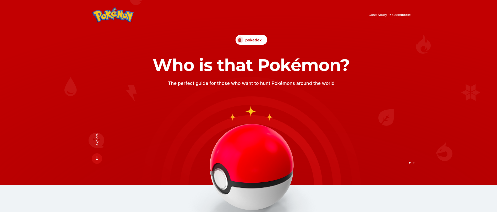

# Projeto PokeApi


Bem-vindo ao PokeAPI Project! Este é um projeto que utiliza HTML, SASS, Gulp e Axios para criar uma aplicação web que consome a PokeAPI, permitindo aos usuários explorar informações sobre Pokémons de forma divertida.

**Link para o projeto em produção**: [PokeApi](https://nogueiraac.github.io/project-pokeapi/)



## Pré-requisitos

Antes de começar, certifique-se de ter as seguintes ferramentas instaladas em sua máquina:

- [Node.js](https://nodejs.org/) - Recomenda-se a versão LTS.
- [Gulp](https://gulpjs.com/) - Para automatização de tarefas.
- Um navegador web moderno como o Google Chrome.

## Instalação

1. Clone este repositório para sua máquina local:

```bash
git clone https://github.com/nogueiraac/project-pokeapi
```

2. Navegue até o diretório do projeto:

```bash
cd pokeapi-project
```

3. Instale as dependências do Node.js:

```bash
npm install
```

## Uso

1. Inicie o servidor local e abra o projeto no navegador:

```bash
gulp
```

2. Agora você pode explorar a PokeAPI, buscar informações sobre seus Pokémon favoritos e muito mais!

## Estrutura do Projeto

- `index.html`: O ponto de entrada da aplicação web.
- `src/`: Pasta que contém os arquivos de código-fonte.
  - `scss/`: Contém os arquivos SASS para estilização.
  - `js/`: Contém os arquivos JavaScript.
- `gulpfile.js`: Arquivo de configuração do Gulp para automatização de tarefas.
- `package.json`: Lista de dependências do Node.js e scripts personalizados.

## Contato

- Autor: Arthur César
- E-mail: 240700ac@gmail.conm
- GitHub: [nogueiraac](https://github.com/nogueiraac)

Sinta-se à vontade para entrar em contato se tiver alguma dúvida, sugestão ou feedback! 